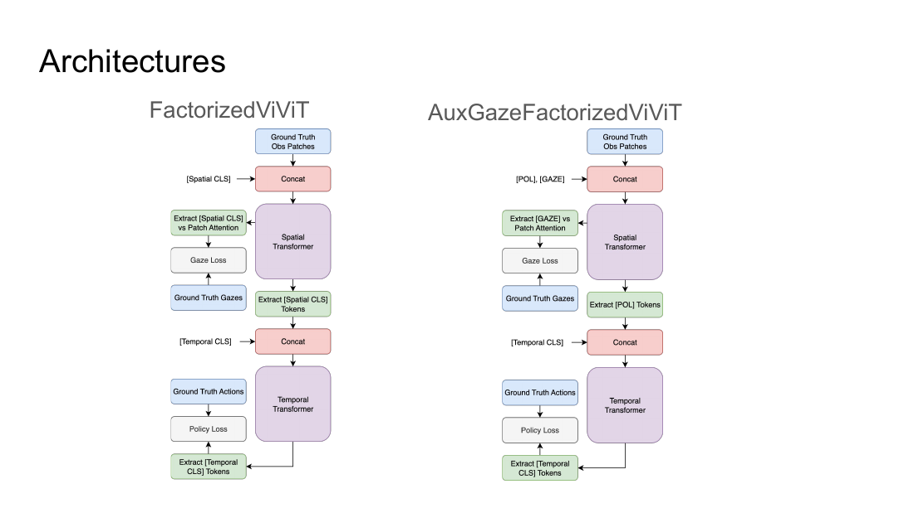
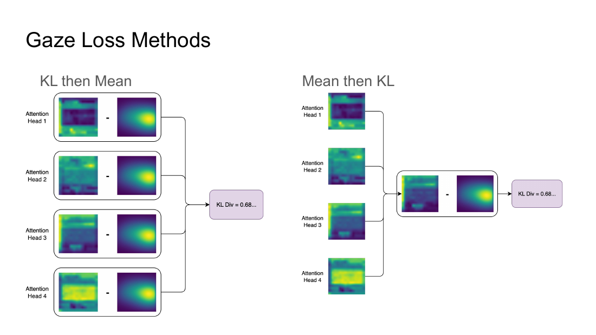
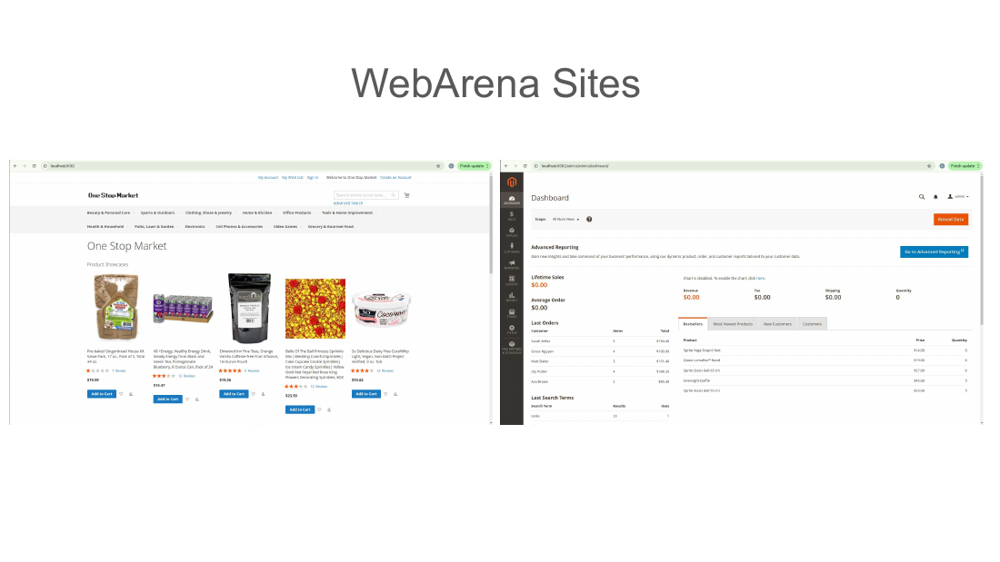
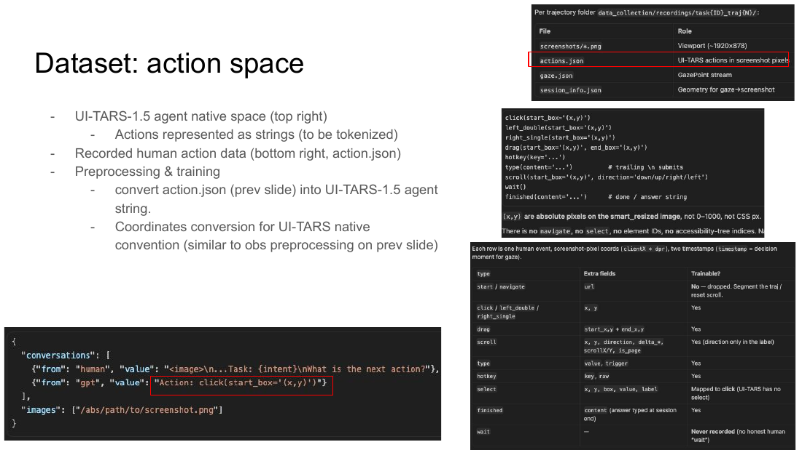

# Project handoff

This is the long-form state of the project. If you are new, read the root `README.md` first, then come back here for the parts that need explaining. The two other docs are `decisions.md`, which records why the method is set up the way it is, and `experiments.md`, which is a generated registry of every run in Weights & Biases.

## Context

The base paper is GABRIL: Gaze-Based Regularization for Mitigating Causal Confusion in Imitation Learning (Banayeeanzade, Bahrani, Zhou, Bıyık, IROS 2025, [arXiv:2507.19647](https://arxiv.org/abs/2507.19647), [project page](https://liralab.usc.edu/gabril/)). GABRIL trains a standard behavioral cloning policy and adds a loss that pulls the policy's internal saliency map toward a heatmap built from where the human looked while collecting the demonstration. The idea is that gaze marks the causally relevant pixels, so a policy that matches gaze is harder to fool with spurious correlations.

In the paper the saliency map is the final convolutional feature map, and the gaze loss is an L2 distance between a learned gaze predictor and the gaze mask. Here the encoder is a factorized ViViT, so the analogue of a saliency map is the spatial transformer's attention, and "make attention look like gaze" becomes a KL divergence. The total objective stays the same shape:

```
L = L_BC + lambda * D_KL(gaze || attention)
```

The data is the Atari subset of the GABRIL human gaze dataset, loaded through the `gabril` path in `dataset.py`.

## Repo layout

| File | What it does |
| --- | --- |
| `train.py` | Entry point. Training loop, gaze KL loss, periodic env rollouts, wandb logging, checkpointing, final test. |
| `config.py` | `Config` dataclass plus the argparse CLI. Every flag has a default here. |
| `vivit.py` | Custom transformer. Attention, `Transformer`, `PatchEmbedding`, and the model variants. |
| `dataset.py` | Loads the GABRIL `.pt` files, rebuilds episodes, builds gaze windows and gaze masks. |
| `env_manager.py` | Gym Atari wrappers used only for evaluation rollouts, not for training data. |
| `augmentation.py` | Albumentations crop and cutout for the images and the gaze masks. |
| `checkpoint.py` | Full-state save/load, including RNG and DataLoader generator states. |
| `device.py` | Picks cuda, then mps, then cpu. |
| `slurm/` | Four array job scripts for the two clusters. |
| `docs/` | This handoff, the decision log, and the experiment registry. |

There is no `transformers` dependency. The transformer is written from scratch with `einops` and `torch`. Do not add HuggingFace imports expecting them to line up with the code.

## Setup

Python is pinned to 3.11 in `pyproject.toml`. I used uv, but any 3.11 environment works.

```bash
uv venv --python 3.11
uv pip install -r pyproject.toml
```

The install pulls in `ale-py`, `autorom`, and `autorom-accept-rom-license`, so you still need to accept the Atari ROM license once (the `autorom-accept-rom-license` package does this on install) and make sure the ROMs resolve through `ale-py`.

The dataset is not in the repo. It is gitignored under `atari-dataset/`. Download the Atari gaze dataset from the [GABRIL project page](https://liralab.usc.edu/gabril/) and lay it out as `atari-dataset/<Game>/num_episodes_<N>_fs4_human.pt`. The loader expects a per-game episode count in `MAX_EPISODES` in `dataset.py:365`; if you add a game, add it there too.

Log in to wandb once so runs land in the same place:

```bash
wandb login
```

Runs log to entity `papaya147-ml`, project `ViViT-GABRIL-Atari` (`train.py:368`). If you change the entity or project, update the links in this repo and expect the old history to look disconnected.

## Running

A single run on a local GPU:

```bash
python train.py --algorithm AuxGazeFactorizedViViT --loading-method gabril \
  --gaze-loss-mode mean_then_kl --game ChopperCommand --seed 100
```

The no-gaze control, which is the BC baseline this project is measured against:

```bash
python train.py --algorithm AuxGazeFactorizedViViT --no-gaze --game ChopperCommand --seed 100
```

The Slurm array scripts sweep the two algorithms across seeds 100 to 107, 16 jobs per game. The game is the first argument.

```bash
sbatch slurm/train-snoopy.slurm ChopperCommand
sbatch slurm/train-carc.slurm Alien
```

On CARC the account is `biyik_1165` and the scripts pin `--partition=gpu` with `--constraint="a100|l40s|v100|a40"` (`slurm/train-carc.slurm:2-12`). Both clusters give each job one 12 GB shard or one GPU and 24 GB of RAM, and both request a 24 hour wall clock. A checkpoint is written every epoch and a resubmitted job resumes from it, so a run that gets cut off is not lost, you just restart it. If you move clusters, the only line you must edit is the interpreter path: `/home1/adsrivat/...` on CARC and `/scr/adsrivat/...` on Snoopy.

## How the model works

There are two live model variants and two dead ones.

`FactorizedViViT` (`vivit.py:346`) embeds each frame into patches, runs a spatial transformer per frame with one CLS token, then runs a temporal transformer over the per-frame CLS tokens. The classification head is a single linear layer on the temporal CLS token.

`AuxGazeFactorizedViViT` (`vivit.py:480`) is the default. It is the same design but the spatial transformer carries two tokens, a policy token and a gaze token. Only the policy token is fed to the temporal transformer and the classifier. The gaze token exists so there is a dedicated place to read spatial attention from.

The other two classes, `ViViT` at `vivit.py:267` and `FusedGazeFactorizedViViT` at `vivit.py:617`, reference a removed `Transformer` keyword (`return_last_block_attn`) and will raise if you instantiate them. They are leftovers from earlier experiments. Ignore them or delete them.



The gaze loss is in `gaze_kl_loss` (`train.py:155`). It takes the spatial transformer's CLS-row attention over patch tokens, reshapes the patch grid to a square, interpolates it to the gaze heatmap size, and computes a KL divergence. Two modes exist. `mean_then_kl` averages heads first and then computes one KL per layer, batch item, and frame (`train.py:176`). `kl_then_mean` computes a KL per head and averages afterward (`train.py:204`). The KL is written as `sum(gaze * (log(gaze) - log(attn)))`, so the target distribution is gaze and the model distribution is attention.



Defaults worth knowing before you launch anything:

| Flag | Default | Meaning |
| --- | --- | --- |
| `--algorithm` | `AuxGazeFactorizedViViT` | Model variant. |
| `--game` | `ChopperCommand` | Atari game. |
| `--loading-method` | `gabril` | Use the GABRIL dataset path. `mine` is an older loader. |
| `--lambda-gaze` | `0.5` | Weight on the gaze KL. |
| `--gaze-loss-layers` | `last` | Which transformer layers contribute. `all`, `first`, `last`. |
| `--gaze-loss-heads` | `all` | `all`, or `half` for the first `max(1, heads // 2)` heads. |
| `--gaze-loss-mode` | `mean_then_kl` | Reduction order. |
| `--frame-stack`, `--frame-skip` | `4`, `4` | Input frames and the skip between them. |
| `--patch-size` | `6` | 84x84 input gives 14x14 = 196 patch tokens per frame. |
| `--epochs`, `--batch-size`, `--train-pct` | `500`, `32`, `0.95` | Training length, batch, and the sequential train/val split. |

The gaze heatmap itself is built from a 41 step window per frame (`short_memory_length=20`, `stride=2`, `num_sigmas=41`, `dataset.py:526`), blurred with `gaze_sigma=15`, and decayed over time with `gaze_alpha=0.7` and `gaze_beta=0.99`. See `gabril_gaze_windows` and `GazeToMask` in `dataset.py`.

See `decisions.md` for why these are set where they are and which ones are still open.

## Training loop details

The BC loss is cross entropy with inverse-frequency class weights, square-rooted and clamped to `[1, 10]` (`train.py:288`). Optimizer is AdamW at `3e-4` with `weight_decay=0.01`. The schedule is a linear warmup over 20 epochs into cosine decay to `1e-6`. Gradients are clipped at norm 1.0 and the step runs under `GradScaler` with fp16 autocast.

A full checkpoint is written every epoch, and a resume is automatic if `latest_checkpoint.pt` exists in the run folder. The run folder is `save_folder/<run_id>`, where `run_id` is the first 12 hex characters of a SHA-256 over the config with `save_folder` and `use_plots` removed (`config.py:82`). That makes the id a fingerprint of the experiment, which is convenient until you change one flag and scatter your old runs.

Validation loss and accuracy are computed every epoch over the held-out 5 percent. Environment rollouts run every 100 epochs and are hardcoded, not driven by `--val-interval`. At the end of training the script evaluates the final model and the best-return checkpoint and logs both as wandb artifacts.

## Results and logs

The generated registry is `experiments.md`, with the full per-run data in `experiments.csv`. It covers 372 runs across eight games, split into the 8-seed sweep (seeds 100 to 107), the Breakout layer and head ablation, and the initial single-seed runs.

The live project is https://wandb.ai/papaya147-ml/ViViT-GABRIL-Atari. The metrics that matter:

- `test/best/mean_return` and `test/final/mean_return`, the 100 episode rollout means at the end.
- `eval/mean_return`, the periodic rollout during training.
- `eval/val_acc`, `train/train_loss`, `train/train_gaze_loss`, and `train/train_policy_loss` for learning curves.

One thing to be aware of before you cite anything: the numbers in the slide deck do not line up exactly with what the registry pulls from wandb, particularly for the factorized gaze runs. The deck was probably built from earlier runs that are no longer in this project. Regenerate the deck from wandb before you put a number in a paper.

The comparison that matters is the same model with and without `--no-gaze`, for both architectures. The slides also carry the extra `gaze_loss_layers` and `gaze_loss_heads` sweep. On Breakout that sweep is very clear: a gaze loss on the first layer collapses the agent to zero return, while the last layer scores in the double digits.

## Known issues and unfinished work

This is the part to read closely. Several things are broken or half-finished, and I would fix the first three before running anything new.

1. **The gaze token is not the token the loss reads.** `AuxGazeFactorizedViViT` returns attention for token index 0 (`vivit.py:595`), which is the policy token, not the gaze token at index 1. Either the gaze token is dead weight or the loss is reading the wrong distribution. Confirm which one you want with me, then make the code match. This is the single most likely reason the auxiliary model does not clearly beat the plain factorized one.

2. **A short run crashes at the end.** The final block unconditionally loads `best_return.pt` (`train.py:605`), but that file is only written after the first rollout at epoch 100. Any run with `--epochs` below 100 raises `FileNotFoundError`. Guard the load or force a rollout before the schedule ends.

3. **The last two model classes do not construct.** `ViViT` and `FusedGazeFactorizedViViT` pass `return_last_block_attn` to `Transformer`, which no longer accepts it. Delete them or port them to `attn_return_layers`.

4. **Temporal masking is disabled.** The causal mask in both live variants is commented out (`vivit.py:413`, `vivit.py:549`). The attention and transformer still support a mask, so it is a toggle away if you want to A/B it. History shows this was flipped on and off more than once.

5. **Some config is dead.** `val_interval` and `scheduler_factor` are parsed but unused. All the light, noise, pixel dropout, posterize, blur, and temporal augmentation flags sit in the config while the code paths are commented out in `augmentation.py`. The `Augment` call only passes crop padding, cutout hole size, and the spatial corruption probability (`train.py:685`), so the rest is decoration.

6. **Device handling assumes CUDA.** `autocast(device_type=device, dtype=torch.float16)` with a default `GradScaler()` will misbehave on mps or cpu. Fine on the lab GPUs, not fine on a laptop.

7. **The "mine" data loader is stale.** `load_data` (`dataset.py:283`) and its helpers are an earlier pipeline. The default `gabril` path is the one the results use. Do not switch casually.

8. **No held-out test set in the usual sense.** Validation is the last 5 percent of steps in file order, and test is 100 live emulator rollouts. There is no shuffled or grouped split, so if you care about the val number, fix the split first.

## The web-agent project

The reason this repo exists is the question of whether gaze regularization carries over to language and UI agents. Danie started that direction in summer 2026. The setup is a soft KL term that pulls the visual attention of UI-TARS-1.5-7B toward human gaze while the model learns to predict UI actions on WebArena.

The three-model comparison is the spine of the project. Model A is base UI-TARS with no training. Model B is behavioral cloning on screenshots and actions. Model C adds the gaze KL on top of B. The target ordering is C over B over A.

The data is human demonstrations on the WebArena shopping site, recorded with a Playwright recorder plus a GazePoint GP3V2 eye tracker. Each trajectory stores screenshots, `actions.json`, `gaze.json`, and `session_info.json` with the screen geometry needed to map gaze back into screenshot pixels. The task split is by task, 131 train, 28 val, 28 test, seed 42, with 15 evaluation task IDs forced into test. Three demos per train and val task is the plan, 477 trajectories total. Danie collected 33 before handing over.





The gaze recipe in that repo is a last-layer, `mean_then_kl` KL with `lambda` around `0.001`, applied only to spatially grounded actions (click, double click, right click, drag, scroll) and skipped for typing and hotkeys, where the eyes are on the keyboard and the gaze samples are not usable. Gaze is aggregated over roughly 200 ms before each action's decision timestamp. Coordinates are absolute pixels via ByteDance `smart_resize`, never 0 to 1000 normalized.

Status when this was written: the recorder is finished and validated end to end, login state regeneration works, and the split is frozen. Vanilla BC training on the 33 collected trajectories runs through LLaMA-Factory with QLoRA. The gaze loss is not yet wired into training, and the evaluation scripts for models A and B still have known bugs. The full handoff, including the recorder internals, data schemas, coordinate mapping, and the exact preprocess and eval fixes, is in `HANDOFF.md` at the root of that repo.

Repos:

- [adsrivatsa/gaze-web-nav](https://github.com/adsrivatsa/gaze-web-nav), the version I control, history preserved from Danie.
- [Danie-Craig/gaze-web-nav](https://github.com/Danie-Craig/gaze-web-nav), the original, kept as `upstream` in the local clone.

## Suggested first steps

1. Get access to the wandb project and the slide deck. Ask me to add you to the `papaya147-ml` entity or re-export the runs under a lab entity if that is cleaner.
2. Download the GABRIL Atari dataset and reproduce one `--no-gaze` ChopperCommand run to confirm the environment works end to end.
3. Fix the three bugs at the top of the previous section. The gaze-token question is the one that can change your conclusions.
4. Re-run the 8-seed sweep for one or two games with the fix and check whether the gaze model now separates from the baseline.
5. Fix the train/val split so the validation number means something.
6. For the web-agent side, read `HANDOFF.md` in the new repo, then finish the preprocess overhaul and wire in the gaze KL with the `lambda` and window above.
7. Decide with Yutai whether the Atari transformer result is worth a paper on its own or whether it is a stepping stone into the web-agent paper.

## People

- PI: Erdem Bıyık, USC LIRA Lab.
- PhD mentor: Yutai Zhou.
- Atari ViViT experiments: Abhinav Srivatsa.
- Web-agent gaze work: Danie Craig Kulandai.

Ask me first for any questions about the code or the experiments, including the gaze window size, the `lambda`, the token question, why a given run exists, and what I tried that did not work. I know this codebase better than these docs do, and I would rather answer a question than have you guess. Yutai is still the person for research direction and decisions that go beyond this repo.

## References

- Amin Banayeeanzade, Fatemeh Bahrani, Yutai Zhou, Erdem Bıyık. GABRIL: Gaze-Based Regularization for Mitigating Causal Confusion in Imitation Learning. IROS 2025. [arXiv:2507.19647](https://arxiv.org/abs/2507.19647).
- GABRIL project page and dataset: https://liralab.usc.edu/gabril/
- Original ViViT architecture: Arnab et al., ViViT: A Video Vision Transformer, 2021.
